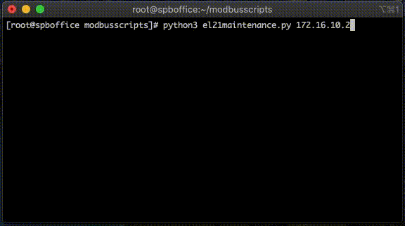

# Electrolyser (EL 2.1) control scripts examples

This repository contains example scripts that allow to control [Electrolyser (EL 2.1)](https://www.enapter.com/electrolyser).

More technical details on the EL 2.1 electrolyser including network requirements, firmware and how to set up your electrolyser in the [Enapter Handbook](https://handbook.enapter.com/electrolyser/el21/el21.html).

---

Example scripts need pymodbus package to be installed. You can install it running:  
`#pip3 install pymodbus`

## el21checkmodbus.py
This script simply checks if Modbus connection is available with connected device.  
EL2.1 IP address is needed to be passed as an argument to this script when you run it. E.g.:  
`#python3 el21checkmodbus.py 192.168.1.2`

## el21maintenance.py
This script guides user through EL 2.1 maintenance process using Modbus TCP.  
The maintenance process is used for first electrolyte fill or periodical change of it.  
EL2.1 IP address is needed to be passed as an argument to this script when you run it. E.g.:  
`#python3 el21maintenance.py 192.168.1.2`

## el21errors.py
This script shows current EL2.1 errors (if any).
You can find a list of errors codes [here](https://handbook.enapter.com/electrolyser/el21/el21_firmware/1.2.1/modbus_tcp_communication_interface.html#error-codes).
EL2.1 IP address is needed to be passed as an argument to this script when you run it. E.g.:  
`#python3 el21errors.py 192.168.1.2`

## ieee754read.py
This script reads Float32 value from a register. You can find more info about input registers [here](https://handbook.enapter.com/electrolyser/el21/el21_firmware/1.2.1/modbus_tcp_communication_interface.html#input-registers-read-only).  
EL2.1 IP address and register number (you can use 1006 for testing purposes) are needed to be passed as an arguments to this script when you run it. E.g.:  
`#python3 el21errors.py 192.168.1.2 1006`

## el21reboot.py
This script writes a value ‘1’ to register 4 (Reboot). You can find more info about holding registers [here](https://handbook.enapter.com/electrolyser/el21/el21_firmware/1.2.1/modbus_tcp_communication_interface.html#holding-registers-read-write).  
EL2.1 IP address is needed to be passed as an arguments to this script when you run it. E.g.:  
`#python3 el21reboot.py 192.168.1.2`

## el21heartbeat.py
This script sets HeartBeat ModBus Timeout. You can find more info about input registers [here](https://handbook.enapter.com/electrolyser/el21/el21_firmware/1.2.1/modbus_tcp_communication_interface.html#input-registers-read-only).  
EL2.1 IP address and timeout (in seconds, 0 - turn HeartBeat ModBus off) are needed to be passed as an arguments to this script when you run it. E.g.:  
`#python3 el21heartbeat.py 192.168.1.2 30`
